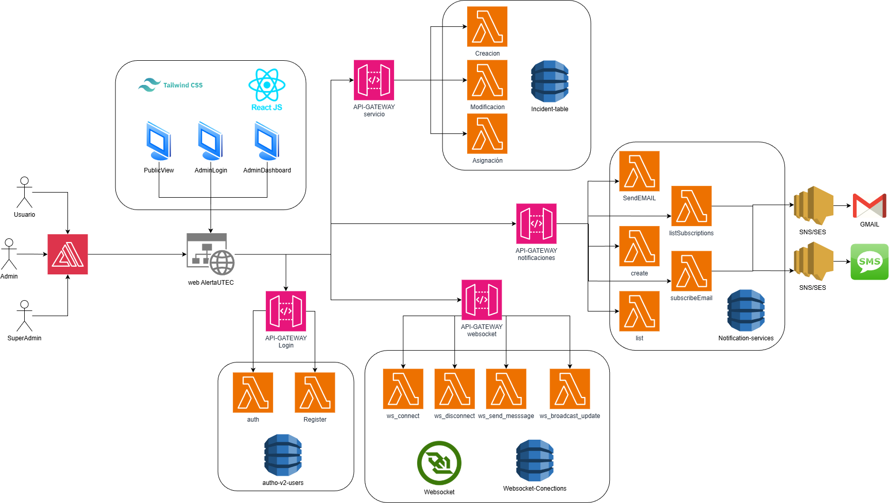

# AlertaUTEC - Sistema de Gestión de Incidentes

El proyecto consiste en un sistema serverless diseñado para reportar, monitorear y gestionar incidentes dentro del campus de UTEC. La solución integra un frontend web para que estudiantes y personal puedan registrar y visualizar reportes, junto con un backend basado en microservicios Lambda que maneja la creación de incidentes, autenticación de usuarios, envío de notificaciones y comunicación en tiempo real mediante WebSockets. Los datos se almacenan en DynamoDB, mientras que la orquestación de flujos programados y tareas batch se realiza con Apache Airflow desplegado en Fargate, asegurando escalabilidad y automatización. Toda la infraestructura se define con Infrastructure as Code (IaC), lo que permite portabilidad y despliegue reproducible en distintas cuentas AWS.

# Integrantes
- Brayan Gomero
- Diego Rivadeneyra
- Domenic Rincon
- Eliseo Velasquez
  
## 📁 Estructura del Proyecto

```
cloud-hackaton/
├── README.md
├── img/
│   ├──diagrama-arquitectura.png 
├── frontend/                        # Aplicación React + Vite + TailwindCSS
│   ├── src/
│   │   ├── components/
│   │   │   ├── PublicView.jsx       # Vista pública de reportes
│   │   │   ├── AdminLogin.jsx       # Login administrativo
│   │   │   └── AdminDashboard.jsx   # Panel de administración
│   │   ├── mockData.js              # Data estática para desarrollo
│   │   ├── App.jsx                  # Componente principal con routing
│   │   ├── main.jsx                 # Entry point
│   │   └── index.css                # Estilos globales
│   ├── package.json
│   └── README.md                    # Documentación del frontend
│
└── backend/            
    ├── node_modules/               # Dependencias
    ├── notifications-lambda/       # Funcion Lambda
        └── notifications.js
    ├── incidents-lambda/           # Funcion Lambda
        └── incidents.js
    ├── auth-lambda/                # Funcion Lambda
        ├── auth.js
        └── seedUsers.js
    ├── websocket-lambda/           # Websocket
        └── websocket.js
    ├── list-logs.js                # Script auxiliar para listar logs
    ├── package-lock.json           # Manejo de versiones
    └── package.json                # Definición de dependencias y scripts
```

## 🎯 Requerimientos del Proyecto

## 1. Registro y Autenticación de Usuarios

- ✔️ El sistema debe permitir registro e inicio de sesión mediante credenciales institucionales
- ✔️ Se debe distinguir entre roles: estudiante, personal administrativo y autoridad

## 2. Reporte de Incidentes

- ✔️ Los usuarios deben poder crear reportes indicando tipo, ubicación, descripción y nivel de urgencia
- ✔️ Cada incidente se almacena en una base de datos serverless (DynamoDB)
- ✔️ Se genera automáticamente un identificador único por reporte

## 3. Actualización y Seguimiento en Tiempo Real

- ✔️ El sistema actualiza el estado de incidentes en tiempo real usando WebSockets
- ✔️ Notificaciones instantáneas cuando un incidente cambia de estado
- ✔️ Estados: pendiente, en atención, resuelto

## 4. Panel Administrativo

- ✔️ Visualizar un panel con todos los incidentes activos
- ✔️ Permitir filtrar, priorizar y cerrar reportes
- ✔️ Actualizaciones en tiempo real sin recargar la página

## 5. Orquestación de Flujos con Apache Airflow

- Clasificación automática de incidentes por tipo o urgencia
- Envío de notificaciones a áreas responsables
- Generación periódica de reportes estadísticos

## 6. Gestión de Notificaciones

- ✔️ Alertas en tiempo real mediante WebSocket y notificaciones asíncronas (correo o SMS) según gravedad

## 7. Historial y Trazabilidad

- ✔️ Historial completo de acciones (creación, actualizaciones, responsables, fecha y hora)

## 8. Escalabilidad y Resiliencia

- ✔️ Componentes serverless y escalables automáticamente

## 9. Análisis Predictivo y Visualización Inteligente (Opcional)

- Integrar modelo de machine learning entrenado en AWS SageMaker
- Identificar patrones, zonas de riesgo y tendencias de recurrencia
- Predicciones sobre tipos de incidentes más probables en áreas y horarios específicos


## 🚀 Quick Start

```bash
# Navegar al backend
cd backend/

# Navegar al frontend
cd frontend

# Instalar dependencias
npm install

# Ejecutar en desarrollo
npm run dev

```

La aplicación estará disponible en `http://localhost:3000`

## 📱 Características Implementadas

### Sistema de Autenticación
- Login único para estudiantes y administradores
- Redirección automática según rol
- Protección de rutas basada en roles
- Mock de usuarios con diferentes permisos

### Vista Estudiante
- Dashboard personal con incidentes propios
- Estadísticas personales (total, pendientes, en proceso, resueltos)
- Formulario para reportar nuevos incidentes
- Vista detallada de cada incidente con historial
- Asociación automática del incidente al estudiante que lo crea

### Panel Administrativo
- Dashboard con estadísticas globales
- Tabla de todos los incidentes con filtros avanzados
- Búsqueda por múltiples criterios
- Asignación de incidentes
- Gestión de estados (Pendiente → En Proceso → Resuelto)
- Historial completo de cambios por incidente
- Información del estudiante que reportó cada incidente

## 🔐 Credenciales de Prueba

**SuperAdministrador:**
```
Email: superadmin@utec.edu.pe
Contraseña: superadmin123
```

**Administrador:**
```
Email: admin@utec.edu.pe
Contraseña: admin123
```

**Estudiante:**
```
Email: juan.lopez@utec.edu.pe
Contraseña: estudiante123
```

Usuarios adicionales disponibles en `frontend/src/mockData.js`

## 🏗️ Arquitectura de solucion (Serverless)


## 🔌 APIs a Implementar

Ver documentación completa en `frontend/README.md`

**Endpoints principales:**
- `POST /api/incidents` - Crear incidente
- `GET /api/incidents` - Listar incidentes
- `PATCH /api/incidents/:id/assign` - Asignar incidente
- `PATCH /api/incidents/:id/status` - Cambiar estado
- `POST /api/admin/login` - Autenticación admin
- `WS /ws` - WebSocket para tiempo real

## 📊 Tecnologías

**Frontend:**
- React 18.3
- Vite 5.4
- TailwindCSS 3.4
- React Router 6.26

**Backend (Por implementar):**
- AWS Lambda (Node.js/Python)
- API Gateway (REST + WebSocket)
- DynamoDB
- S3
- Apache Airflow

## 👥 Roles de Usuario

### Estudiante
- Reportar incidentes (requiere autenticación)
- Ver solo sus propios incidentes reportados
- Recibir código de seguimiento
- Ver historial y estado de sus reportes

### Administrador
- Visualizar todos los incidentes del campus
- Asignarse incidentes
- Cambiar estados de incidentes
- Ver historial completo de cada incidente
- Acceso a estadísticas globales
- Ver información del estudiante que reportó cada incidente
  
### SuperAdministrador
- Visualizar todos los incidentes del campus
- Asignar incidentes
- Ver historial completo de cada incidente
- Acceso a estadísticas globales
- Ver información del estudiante que reportó cada incidente

## 📝 Notas

- El frontend está completamente funcional con data mock
- Todos los puntos de integración con APIs están claramente marcados en el código
- La UI está diseñada para ser responsive y accesible
- Se recomienda revisar `frontend/README.md` para detalles técnicos completos

---

**Universidad de Ingeniería y Tecnología (UTEC)**  
Sistema AlertaUTEC v1.0
